{:class="img-responsive"}


## Besoin 

Dans le cadre de mes divers labs, formation ou autre expérimentation de cybersécurité j'avais pour habitude de lancer des machines virtuelles sur mon poste en local. Seulement cette approche pose plusieurs problèmes. Déjà en tant que propriétaire de Mac M2 je ne pouvais pas faire fonctionner de manière fiable des machines virtuels a base de processeur X86. Enfin, jongler entre mon poste fixe et mn laptop rendais difficile de débuter un travail sur une machine (typiquement mon laptop) et de le finir ensuite sur une autre (mon poste fixe). 

## Idée 

J'ai d'abord pensé a souscrire a un abonnement OVH ou autre pour un Bare Metal me permettant de déployer un Proxmox ou tout autre solution de virtualisation pour y déployer des machines en fonction des besoins. Mais je souhaitais avoir une machine installée chez moi, pouvoir exploiter mon serveur NAS et n'avais pas forcément besoin d'un Proxmox et de toutes ses fonctionnalités. 

J'ai donc tourné mon attention vers une machine de type Intel Nuc afin d'héberger une machine faible consommation chez moi avec des capacités de virtualisation et des performances suffisante pour y parvenir. Dans mon cas je souhaitais un budget maintenus avec les spécifications minimum suivantes : 

- 32 Go de RAM
- 8 coeurs CPU 
- 1 To de stockage local

> De plus cette approche me permets de déporter mon lab et m'évite au maximum de perdre mon travail en cas de vol de mon laptop tout en me permettant d'exploiter mes vieux Thinkpads au besoin pour travailler sur mes labs.

Il me suffirait ensuite de mettre en place une solution VPN comme Wireguard ou Tailscale. 

## Solution 

Pour mon serveur je suis donc partis sur la configuration suivante :

- Un Minisforum UM690 Slim
- 2 To de stockage Nvme 
- Une barette de 48 Go de RAM

L'UM690 Slim offre un CPU Ryzen 9 6900HX avec 6 coeurs et 16 Threads ce qui réponds au besoin. Pour ce qui est de la RAM j'ai privilégié la capacité de mise a jour du matériel aux performances pure ce qui explique le choix d'une seule barrette. Le CPU étant capable de gérer jusqu'a 96 Go de RAM il m'est passible de rajouter une barrette plus tard si j'ai besoin de plus de mémoire vive. Ce qui serait plus pratique que de devoir remplacer deux barrettes. 

Pour ce qui est de l'accès distant je vais partir sur Tailscale. En effet, bien que la solution soit moins indépendante que Wireguard, elle me permets de modifier a la volée la configuration du VPN et d'ajouter/supprimer facilement des agents. C'est surtout pratique dans mon cas pour me permettre d'ajouter ou supprimer des machines en fonction de mes besoins et surtout pour être capable de supprimer une machine cliente en cas de vol. 

Enfin cette solution permets de se passer de solutions comme DynDNS pour permettre l'accès distant quand les IP fixes ne sont pas disponibles chez votre FAI.

Pour ce qui est de la sécurisation de l'accès je vais déployer une machine Bastion SSH qui seras le seule point d'entrée vers les machines virtuelles. Dans le cas du SSH, le Bastion serviras de jump host et tous les autres protocoles passerons par des tunnels SSH (le RDP par exemple). Ce Bastion porteras son propre agent Tailscale afin d'être joignable en direct tout en plaçant des ACL. 
Le serveur en lui-même seras également équipé d'un agent Tailscale afin d'exposer un interface web de gestion des VM, lui aussi avec des ACL. 

Pour ce qui est de la virtualisation, je souhaitais utiliser KVM car c'est un hyperviseur que je maitrise bien. Néanmoins suite a l'arrêt de la maintenance de Virt-Manager, je ne disposait plus de solution pratique et efficace pour gérer mes VM. Fort heureusement une solution de remplacement du nom de Cockpit existe et est suffisamment mature pour mon besoin. 

Nous avons donc le Hardware, la solution de virtualisation, les solutions d'accès a distance et enfin une solution de sécurisation.

Voici le schéma de principe de tout ce que l'on s'est dis : 

```mermaid
graph TD;
  
  %% Internet et accès externe
  subgraph WAN
    Internet["🌍 Internet"]
  end

  subgraph TAILSCALE_NET["VPN Tailscale"]
    DEB_BASTION["🔒 DEB-BASTION (99.98.66.2)"]
    VM_SRV["🖥️ VM-SRV (99.98.66.1)"]
  end

  subgraph LOCAL_NET["Réseau Local"]
    VM_SRV_LOCAL["🖥️ VM-SRV (192.168.1.xx)"]
  end

  subgraph VIRTUAL_NET["KVM (192.168.122.0/24)"]
    KAL_PENTEST["🐉 KAL-PENTEST (192.168.122.xx)"]
    WIN_COMPIL["🖥️ WIN-COMPIL (192.168.122.xx)"]
  end

  %% Flux réseau physique
  Internet -..->|"🚫 Pas d'accès direct"| DEB_BASTION
  Internet -..->|"🚫 Pas d'accès direct"| VM_SRV

  DEB_BASTION -->|Tailscale VPN| VM_SRV
  VM_SRV -- eno1 --> VM_SRV_LOCAL
  VM_SRV -- virbr0 --> KAL_PENTEST
  VM_SRV -- virbr0 --> WIN_COMPIL
  
  %% Flux logiques (SSH, tunnels)
  DEB_BASTION ==>|"Jump Host"| KAL_PENTEST
  DEB_BASTION ==>|"Jump Host"| WIN_COMPIL
  DEB_BASTION ==>|"Tunnel SSH 3389 (RDP)"| WIN_COMPIL

  %% Légendes des flux
 subgraph EXPLICATIONS ["💡 Explications"]
    Note1["🔹 DEB-BASTION est accessible uniquement via Tailscale"]
    Note2["🔹 VM-SRV héberge les VM et expose le port 9090"]
    Note3["🔹 WIN-COMPIL est accessible en RDP via tunnel SSH"]
  end

  Note1 --> DEB_BASTION
  Note2 --> VM_SRV
  Note3 --> WIN_COMPIL


```



> Les IP sont volontairement bidons

### Le Bastion 

Le serveur de bastion est configuré pour refuser toutes les connexions avec session interactives et ne permets que de réaliser du tunneling ou du Jump Host. Pour cela j'ai déployé une configuration qui ressemble a ceci : 

```bash
sudo usermod --shell /usr/sbin/nologin bastion

## /etc/ssh/sshd_config
# Désactiver l'authentification par mot de passe
PasswordAuthentication no
ChallengeResponseAuthentication no

# Désactiver l'accès interactif au compte "bastion"
Match User bastion
    PermitTTY no
    ForceCommand echo "Accès interdit en mode interactif"
```

Pour accéder aux machines virtuels, je vais exploiter deux paires de clé SSH. Une permettant de se connecter du client vers le Bastion et une permettant de se connecter du Bastion a la VM cible : 

```mermaid
graph TD;

  %% Définition des machines
  subgraph CLIENT["💻 Client"]
    Client["👤 Utilisateur"]
  end

  subgraph BASTION["🛡️ Bastion"]
    Bastion["🔒 Serveur Bastion"]
  end

  subgraph CIBLE["🎯 Machine Cible"]
    Cible["🖥️ Serveur Cible"]
  end

  %% Connexions SSH
  Client -.->|"🔑 Clé SSH 1 et 2"| Bastion
  Bastion -.->|"🔑 Clé SSH 2"| Cible
```



J'aurais aimé faire en sorte que le Bastion porte sa propre clé SSH afin d'éviter de devoir me trimballer deux clés mais je ne suis pas parvenus a faire autrement. 

### Les ACL 

Sur Tailscale, j'ai mis en place des ACL afin de sécuriser les accès aux diverses interfaces/services. Je souhaite uniquement joindre le serveur hyperviseur via son interface web et n'autoriser que le port SSH vers le Bastion. Voici donc la configuration choisie : 

```mermaid
graph TD;

  %% Définition des machines et tags
  subgraph SERVERS["🖥️ Serveurs"]
    VM_SRV["🖥️ VM-SRV\n(tag:server)"]
    DEB_BASTION["🔒 DEB-BASTION\n(tag:admin)"]
  end

  %% Définition des ACLs
  subgraph RULES["📜 ACLs"]
    ACL1["✅ Autorise * → tag:server:9090"]
    ACL2["✅ Autorise * → tag:admin:22"]
  end

  %% Liaisons des ACLs aux machines concernées
  ACL1 -->|Port Cockpit Web| VM_SRV
  ACL2 -->|Port SSH| DEB_BASTION


```




Ce qui donne en cas concret : 

```bash
{
	"tagOwners": {
		"tag:server": ["autogroup:admin"], // VM-SRV
		"tag:admin":  ["autogroup:admin"], // DEB-BASTION
	},

	"acls": [
		// 🔹 Autoriser SSH (22) et Cockpit Web (9090) pour les serveurs
		{
			"action": "accept",
			"src":    ["*"],
			"dst":    ["tag:server:9090"],
		},

		// 🔹 Autoriser SSH (22) pour DEB-BASTION
		{
			"action": "accept",
			"src":    ["*"],
			"dst":    ["tag:admin:22"],
		},
	],
}

```

Enfin, j'ai mis en place une régle iptables pour bloquer completement toutes tentative de connexion a mon réseau local depuis une VM. Cela permets d'éviter toutes fuites involontaire vers mon réseau local : 

Blocage des IP locales via les VM : 

```bash
sudo iptables -I FORWARD -i virbr0 -d 192.168.1.0/24 -j DROP
```

Enfin, pour simplifier mon utilisation quotidienne aux machines, j'ai mis en place une configuration SSH : 

```bash
# Login Bastion 
Host deb-bastion
  Hostname 99.98.66.2
  User bastion
  ForwardAgent yes
# Login kali en SSH
Host kal-pentest
  Hostname 192.168.122.xx
  User jugu
  ForwardAgent yes
  IdentityFile ~/.ssh/id_rsa_bastion
  ProxyJump deb-bastion
# Monter les tunnel SSH pour exposer le 3389 des machines
Host VM_ALL
  HostName deb-bastion
  User bastion
  LocalForward 3389 192.168.122.xx:3389
  LocalForward 3390 192.168.122.xx:3389
  RequestTTY no
```

J'ai une configuration pour permettre la connexion au bastion, elle serviras ensuite pour le jump host vers la machine Kali Linux de l'exemple. Pour finir, une dernière configuration permets de créer des tunnel SSH pour ouvrir des connexions RDP vers les VM. 

Il suffit alors de rajouter des machines au besoin en se basant sur la même configuration. 

